# Auralis — make sound visible

A real-time, music-reactive visualiser for the browser: psychedelic flowers,
neon landscapes, enclosed tunnels, crystalline worlds and flowing feedback.
**15 effects. Live Mac microphone input. Procedural graphics. No audio uploads.**

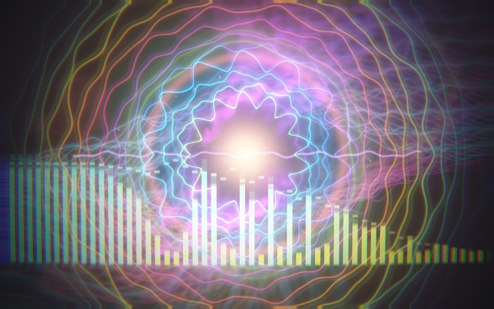

## Tech stack

| Technology | Role |
| --- | --- |
| **Three.js 0.180 + WebGL / GLSL** | GPU scenes, procedural geometry, instancing, camera paths and custom shaders. |
| **p5.js 2.3** | Reactive particles, spring-smoothed waveforms and segmented spectrum overlays. |
| **Web Audio API** | Microphone/local-file input, 2,048-point FFT, six frequency bands, waveform analysis, transient and tempo detection. |
| **Custom GPU rendering** | Half-float HDR targets, bloom, feedback trails, fluid simulation, tone mapping and live scene blending. |
| **JavaScript ES modules + HTML/CSS** | Application state, accessible controls, responsive UI and browser-local preferences. No React or backend server. |
| **Vite 7.3** | Local development server and production bundling. |
| **Vitest 5** | Automated coverage for audio, scenes, motion, transitions, resources and rotation controls. |
| **Node.js 22.12+ / npm** | Development tooling and the Chrome screenshot capture script. |

Exact dependency versions are pinned in [package-lock.json](package-lock.json).

## What it does

- Responds to bass, mids, treble, waveform shape and detected beats—not just overall volume.
- Generates scenes in real time, including instanced crystals, streaming terrain,
  closed-loop tunnel geometry, fluid smoke and persistent neon trails.
- Blends between two live scenes over **1.6 seconds**, without fading through black.
- Offers four colour palettes, adjustable sensitivity, fullscreen and a visual-only mode.
- Provides **Auto / High / Ultra** quality settings, bounded resource pools and
  adaptive render scaling in Auto mode.
- Lets you select which scenes Auto Director cycles through every **16 detected beats**.
- Processes audio on the device. Microphone sound is not recorded or uploaded.

## Run locally

Use Node.js **22 LTS (22.12+) or 24 LTS** and a current WebGL-capable browser.

```sh
git clone https://github.com/SkiltonUSA/auralis-music-visualiser.git
cd auralis-music-visualiser
npm ci
npm run dev
```

Open the URL printed by Vite, normally `http://localhost:5173`, and choose:

- **Mac microphone** — allow browser/macOS microphone access, then play music in the room.
- **Open an audio file** — play a local file in a format your browser supports.
- **Demo signal** — explore without microphone access or a music file. This is a
  synthetic visual-analysis signal, not an included audible music track.

Microphone access requires **localhost or HTTPS**; opening `index.html` directly
will not work. The microphone captures the room, not native system-loopback audio.
For music played through headphones, use local-file playback or an audio-routing
device configured outside the app.

## Effect gallery

Every image below is an actual browser capture of the current app, using the
built-in demo signal in visual-only mode at **1280 × 800**. Procedural seeds and
music change the appearance between sessions. Click an image to view it at full size.

| Scene | Effect and music response | Screenshot |
| --- | --- | --- |
| **01 · Bloom** | Mirrored flowers, travelling waveform rings, fluid smoke and a restrained Geiss Flow background. Bass opens the petals; beats launch sound waves. | [](docs/screenshots/01-bloom.jpg) |
| **02 · Prism** | Fractured, kaleidoscopic light with crystalline symmetry that responds to spectral energy and transients. | [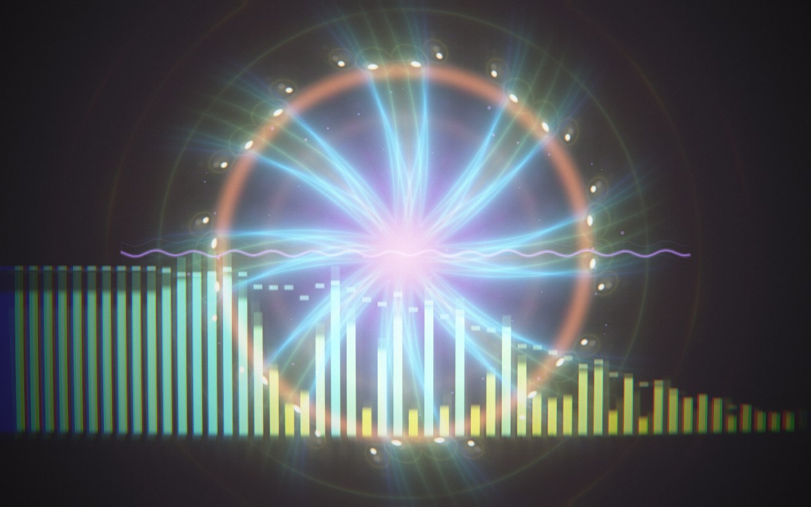](docs/screenshots/02-prism.jpg) |
| **03 · Signal** | A living waveform mesh, mirrored segmented spectrum and peak-hold traces showing the shape of the mix. | [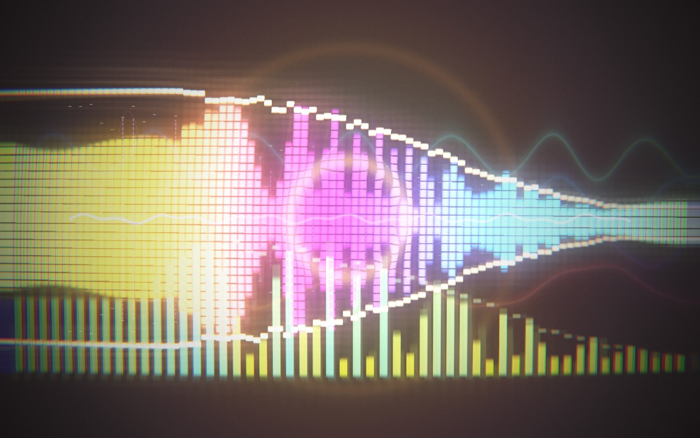](docs/screenshots/03-signal.jpg) |
| **04 · Torus** | Fly inside a curving checker tunnel. Walls breathe with bass; every fifth tile flashes on detected beats. | [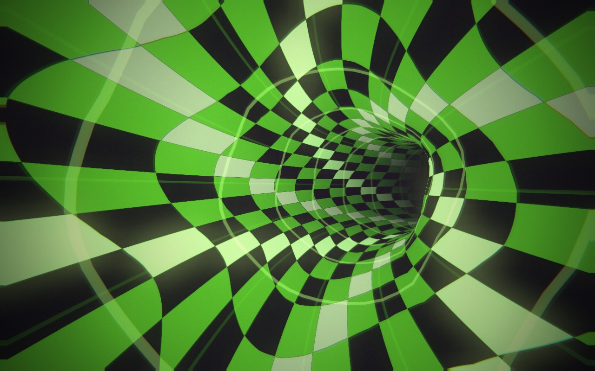](docs/screenshots/04-torus.jpg) |
| **05 · Warp** | A smoky space-time wormhole with spectral folds, depth and beat-driven light. | [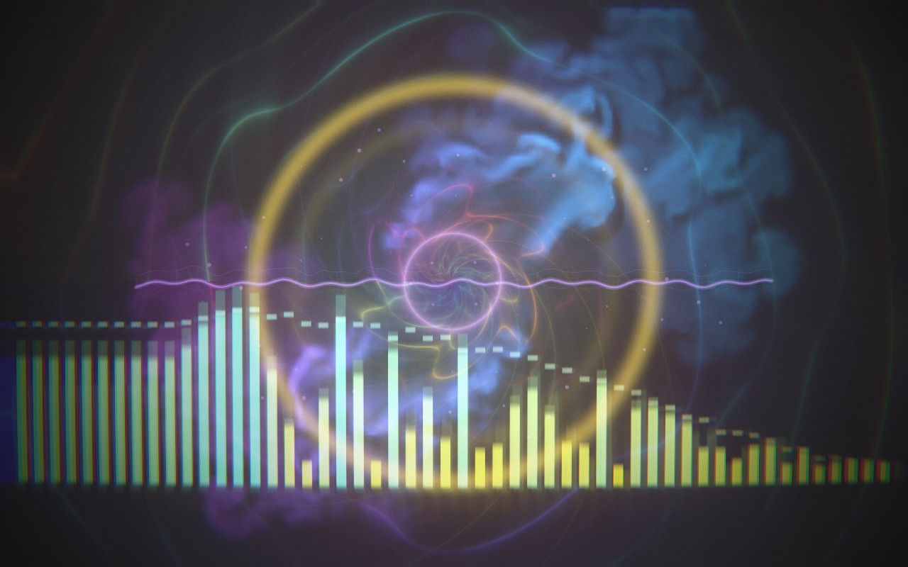](docs/screenshots/05-warp.jpg) |
| **06 · Valley** | A smooth bird-like flight through music-shaped ridges and valleys, with a deep horizon and thin drifting wisps. | [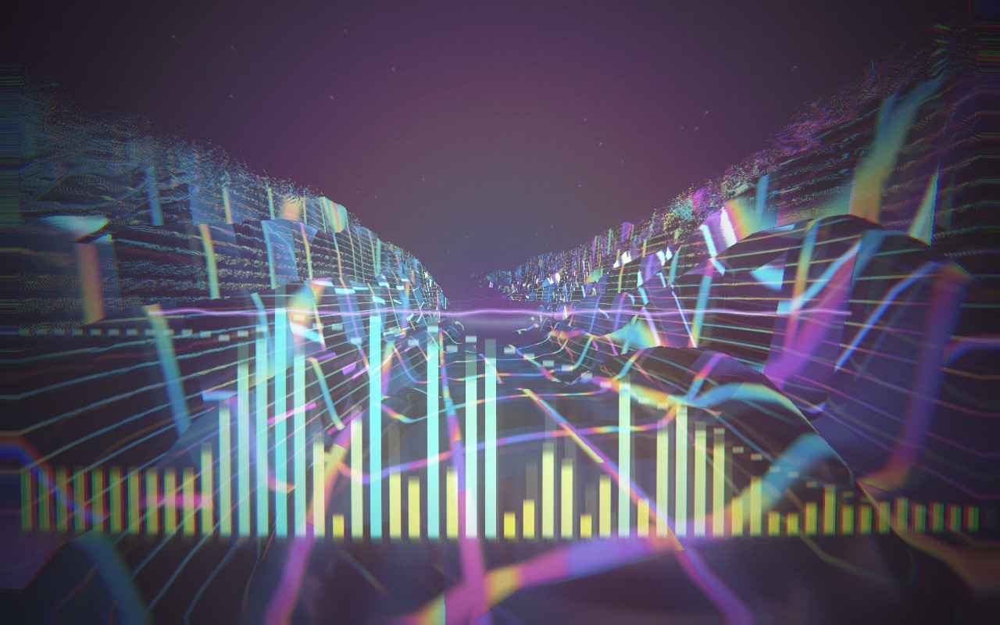](docs/screenshots/06-valley.jpg) |
| **07 · Reactor** | A radial instrument-like structure with concentric details and transient-driven bursts. | [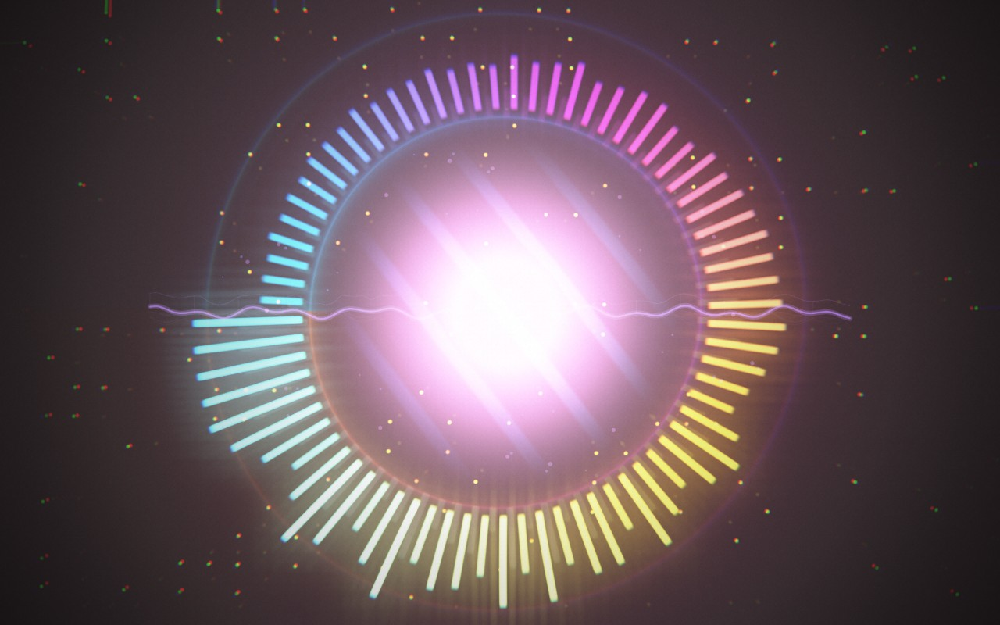](docs/screenshots/07-reactor.jpg) |
| **08 · Horizon** | 29 mirrored frequency bands form a skyline above a perspective floor. A subtle music-reactive ASCII field drifts behind it. | [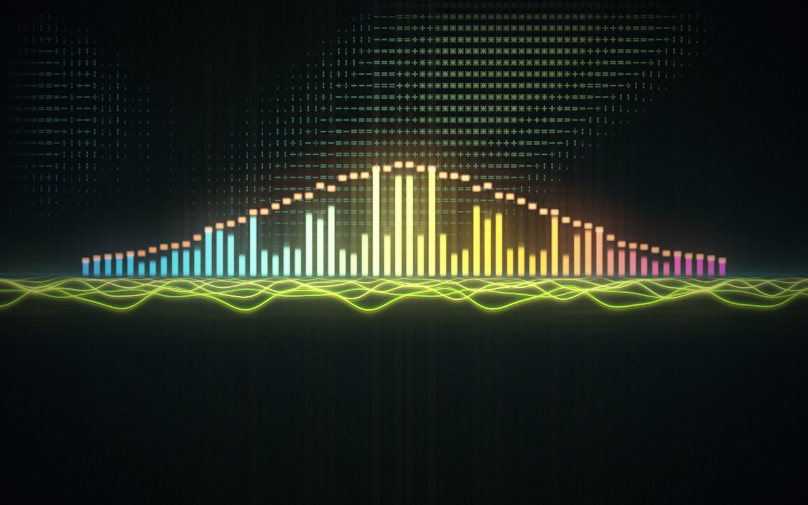](docs/screenshots/08-horizon.jpg) |
| **09 · Radial** | Extruded circular spectrum blocks with slow, smoothly integrated musical rotation and responsive highlights. | [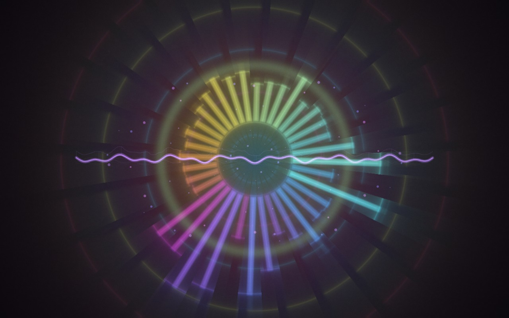](docs/screenshots/09-radial.jpg) |
| **10 · Arc** | Electric orbital rings, spectral smoke and high-frequency sparks. | [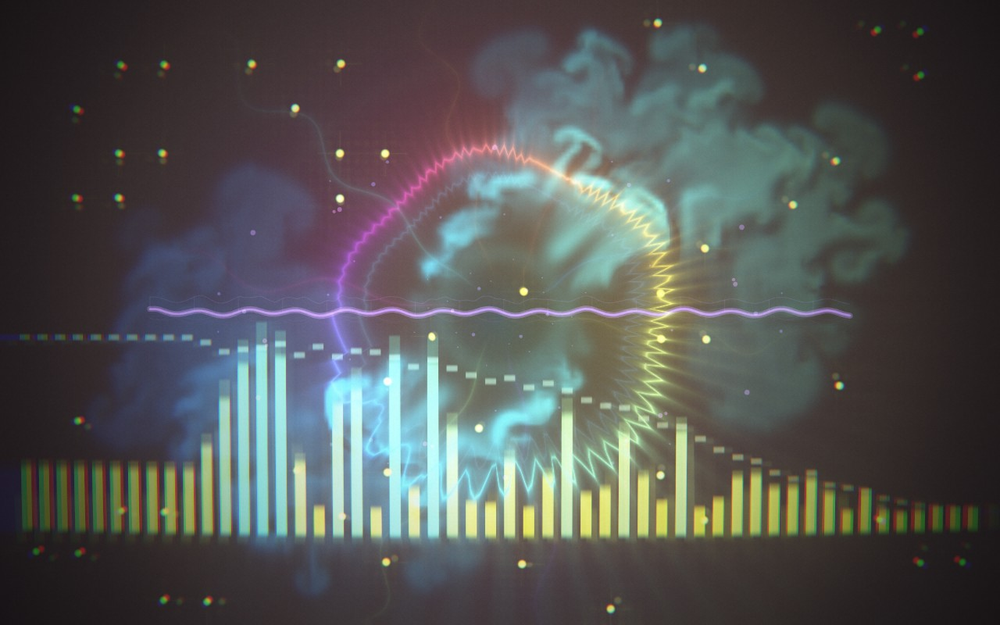](docs/screenshots/10-arc.jpg) |
| **11 · Crystals** | A neon globe whose spin smoothly follows musical tempo, with beat-rippling triangular faces and growing shards. Spirit-style GPU particles, a passing smoke wisp, matching aurora curtains and Horizon's approaching waveform floor surround the formation. | [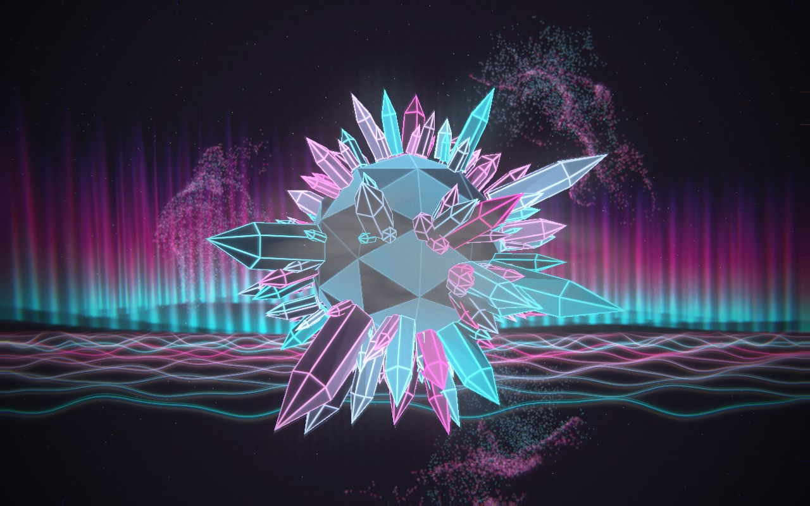](docs/screenshots/11-crystals.jpg) |
| **12 · Neon Road** | An ’80s neon highway with a route-following camera, striped sunset, grid mountains, roadside lights, smoke and clouds. | [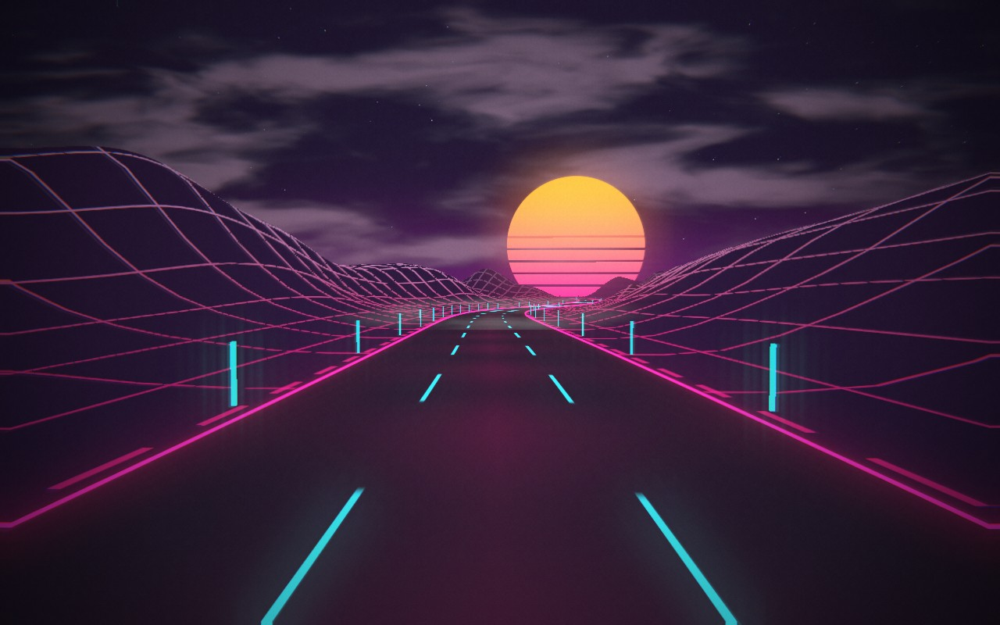](docs/screenshots/12-neon-road.jpg) |
| **13 · Tunnel** | A seamless plasma tunnel with fast corkscrew flight and banking. Each detected beat launches one narrow cyan pulse from the bend towards the viewer, leaving dark space behind it. | [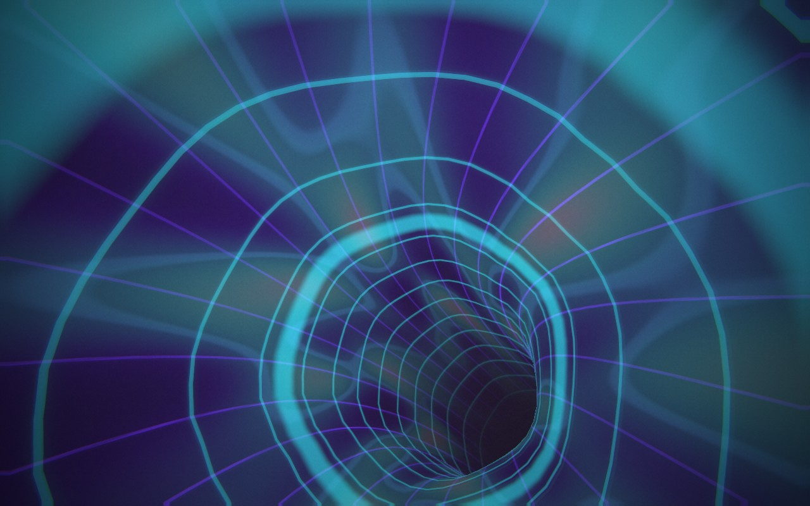](docs/screenshots/13-tunnel.jpg) |
| **14 · Flyover** | Fast neon terrain flyovers over mountains and waterways, with procedural terrain chunks, clouds and depth-tested smoke. | [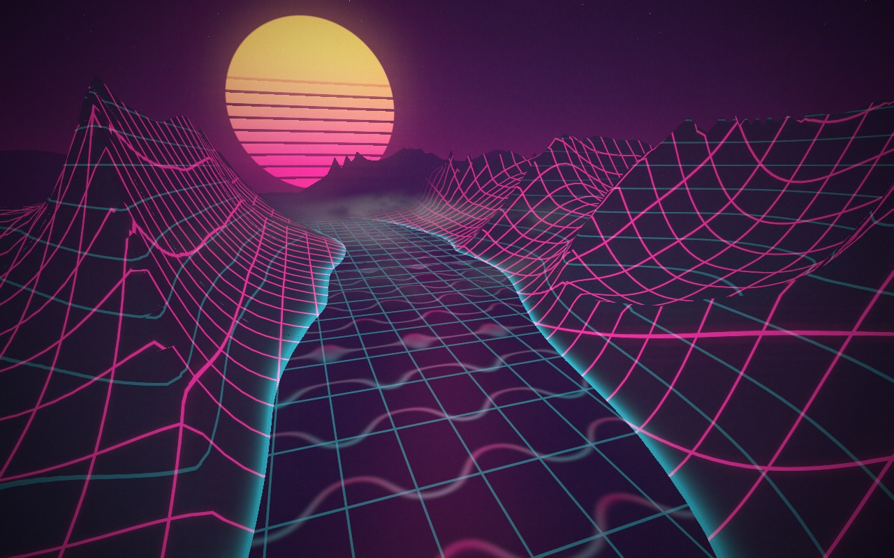](docs/screenshots/14-flyover.jpg) |
| **15 · Geiss Flow** | The waveform feeds persistent neon trails that morph between expanding spirals, paired vortices and winding currents. | [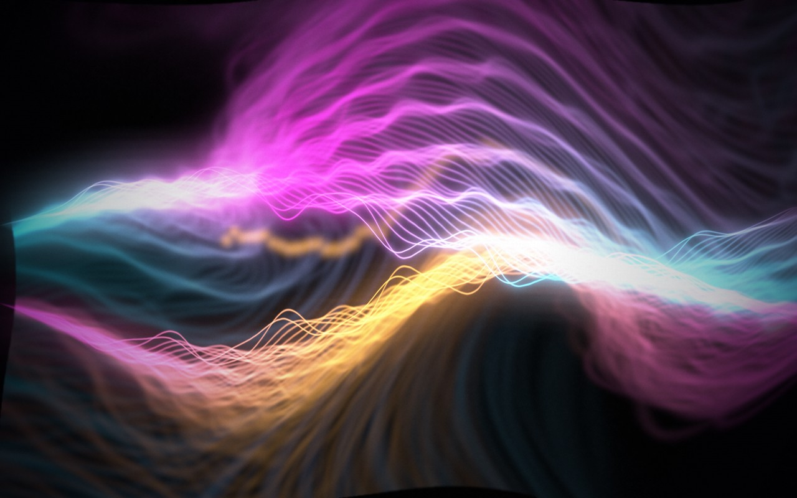](docs/screenshots/15-geiss-flow.jpg) |

## Controls

| Control | Action |
| --- | --- |
| **Side icons** | Include/exclude scenes from Auto Director—not effect-layer toggles. |
| **Lit dot / dim dash** | Scene enabled / excluded from rotation. |
| **Bright outline** | Currently selected scene, independent of rotation membership. |
| **← / →** | Preview any scene, including excluded scenes. |
| **1–9** | Preview scenes 1–9. |
| **A** | Toggle Auto Director. |
| **Space** | Pause/resume visuals; when a button is focused, activate that button. |
| **O** | Hide/show all text, controls and framing for visuals only. |
| **H** | Hide/show the main interface. |
| **F** | Toggle fullscreen. |
| **Settings** | Audio source, particle veil, Auto Director and render quality. |

Rotation choices are saved locally in your browser. Auto Director skips excluded
scenes. Disabling its current selection blends to the next enabled scene. One
enabled scene holds; disabling every scene holds the current picture and stops
automatic scene changes. Manual previews do not change the saved rotation.

## Development and production

```sh
npm test          # automated test suite
npm run build    # production files in dist/
npm run preview  # serve the production build locally
```

The production app is static: deploy `dist/` to an HTTPS static host. No application
server, API key, database, Python environment or native audio plug-in is required.
For subdirectory hosting, configure Vite's base path for the deployment location.

### Project structure

```text
src/
  audio-engine.js          Microphone/file/demo sources, FFT and beat analysis
  visual-engine.js         Main renderer, scene shaders and layer composition
  procedural-scenes.js     Lazy procedural worlds and crystal formations
  terrain-flyover.js       Streaming terrain and route-following flight
  neon-road.js             Procedural synthwave road
  endless-tunnel.js        Enclosed checker and plasma tunnel geometry
  tunnel-ring-pulses.js    Narrow beat pulses travelling towards the camera
  neon-crystals.js         Neon edges and individual triangular face lighting
  crystal-facet-ripples.js Beat-triggered ripples across the crystal surface
  crystal-tempo-spin.js    Smooth BPM-driven globe rotation
  crystal-wave-floor.js    Horizon's waveform floor beneath the aurora
  geiss-flow.js            Persistent waveform-fed GPU feedback
  horizon-ascii.js         Cached glyph atlas and ASCII background shader
  smoke-simulation.js      Audio-reactive fluid simulation
  bloom-waves.js           Travelling waveform snapshots
  post-processing.js       HDR bloom, feedback and cinematic finishing
  particle-overlay.js      p5.js particles and spring waveform overlays
  scene-blend.js           Live crossfade state and queued selections
  scene-mixer.js           Two-scene HDR compositing
  scene-rotation.js        Auto Director inclusion/exclusion state
  scenes.js               Scene catalogue and stable renderer IDs
  main.js                 UI, preferences and animation orchestration
  *.test.js               Regression tests
docs/screenshots/         All 15 scene captures and their manifest
scripts/capture-gallery.mjs
```

Detailed implementation notes, effect tuning and creative provenance are in
[docs/technical-notes.md](docs/technical-notes.md).

### Regenerate screenshots

Use a **dedicated Chrome profile**, not your normal browsing session. First start
Vite, then launch Chrome with remote debugging enabled (macOS example):

```sh
"/Applications/Google Chrome.app/Contents/MacOS/Google Chrome" \
  --headless=new --remote-debugging-port=9231 \
  --user-data-dir="$(mktemp -d /tmp/auralis-gallery.XXXXXX)" \
  --window-size=1280,800 http://127.0.0.1:5173/
```

In another terminal, from the project directory:

```sh
APP_URL=http://127.0.0.1:5173/ CDP_PORT=9231 npm run screenshots
```

The script uses the real demo signal, warms up each scene, waits until no blend is
active, and captures the browser output. Originals are saved under the ignored
`.context/gallery/` directory; README copies and capture metadata go into
`docs/screenshots/`. It checks for browser errors and adds no browser automation
dependency. Allow several minutes, especially with software rendering.

## Performance and troubleshooting

- **Start with Auto quality.** Ultra increases GPU cost, especially during live
  blends and procedural scenes. Performance depends on the GPU and display size.
- **No microphone response?** Check the selected input, browser permission and
  macOS microphone privacy settings. Try Demo to isolate rendering from input issues.
- **No audible demo?** Expected: Demo drives the visualiser without playing a song.
- **Scene never appears automatically?** Enable its side icon and Auto Director.
- **Blank canvas or graphics errors?** Use a current browser with hardware acceleration
  and WebGL enabled. Device capabilities can limit fluid smoke support.
- **Build warnings?** The bundle is currently large; Vite may issue a chunk-size
  warning. It is a warning, not a failed build. Code splitting is a future improvement.

## Credits and licensing

Creative references include Jeff Minter's psychedelic visualisers, Fosfora,
ShaderAmp, pdoom-video, NEON, AudioVisualize, Astrofox and Geiss. Geometry, tunnel
and fluid-simulation adaptations are credited individually. Roomtone inspired
the ASCII composition; its source is not copied. Geiss Flow is an original GPU
implementation of the waveform-and-warp feedback idea, not a native Winamp port.

See [THIRD_PARTY_NOTICES.md](THIRD_PARTY_NOTICES.md) for provenance, source links
and retained third-party license notices. A project-wide license for original
Auralis code has not yet been selected; creating this backup does not change
the licenses of included third-party material.
