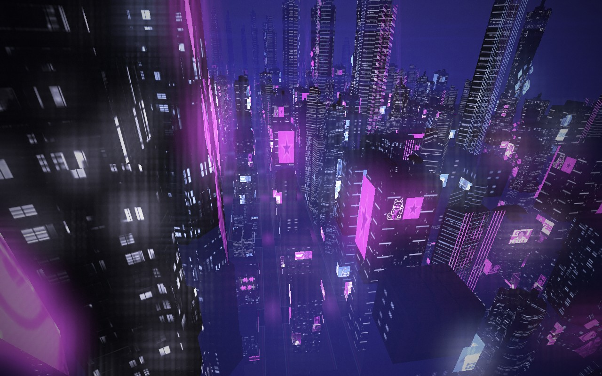
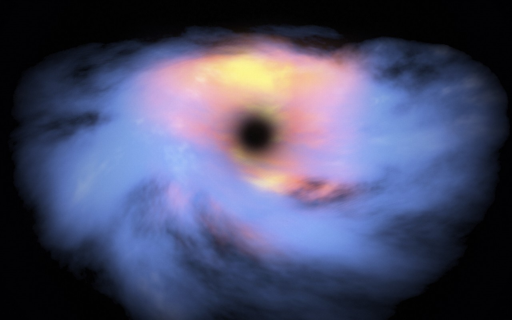
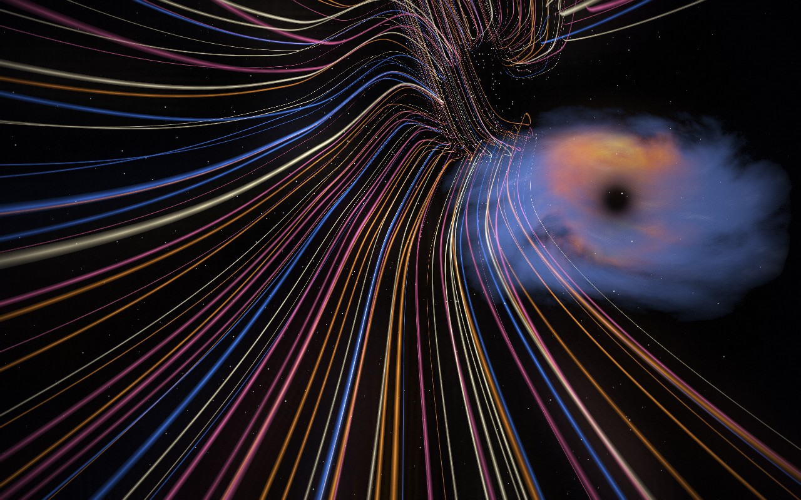
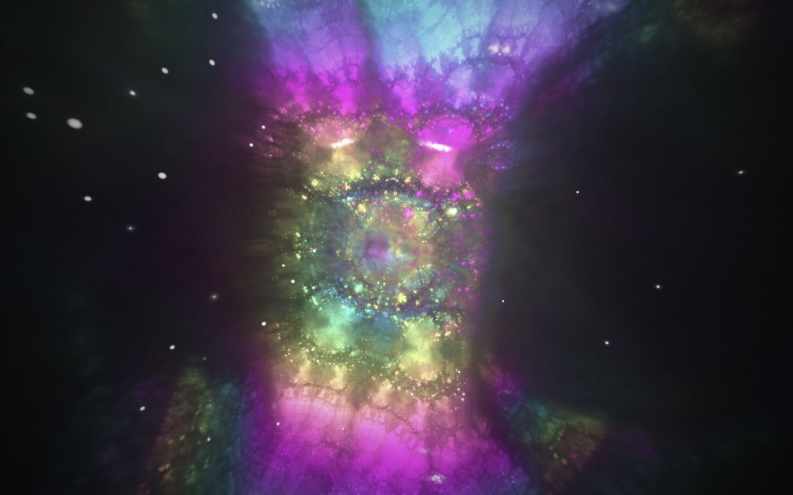
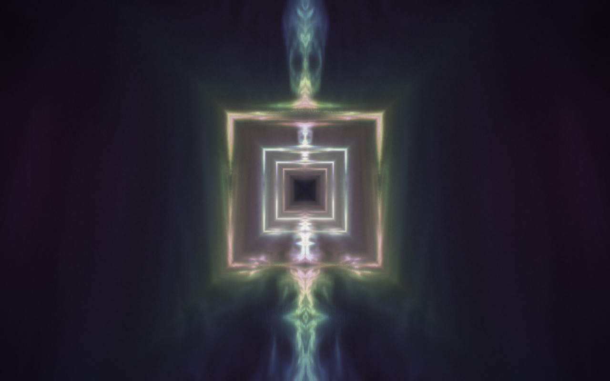
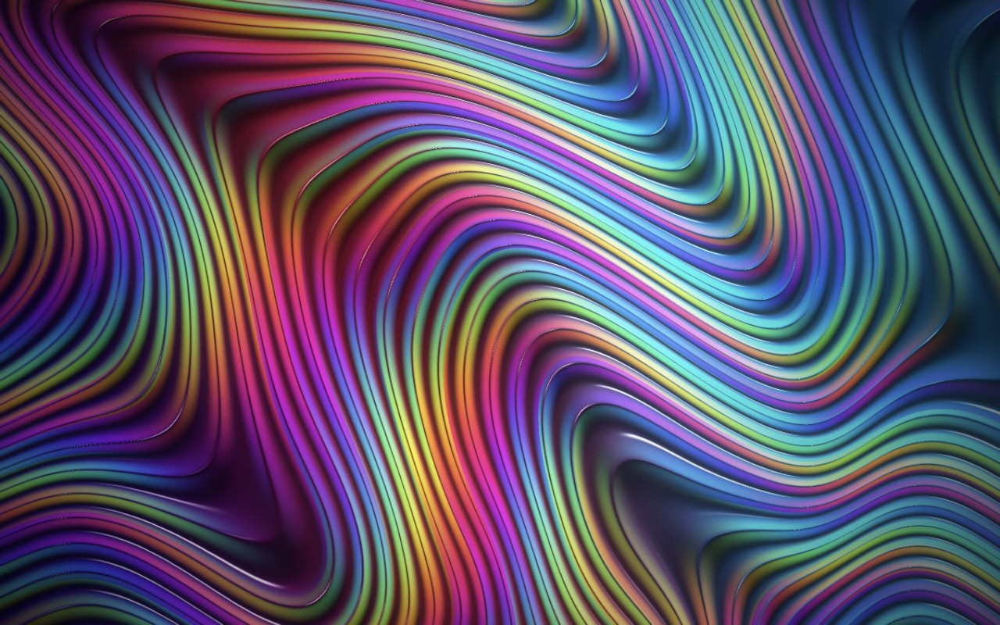
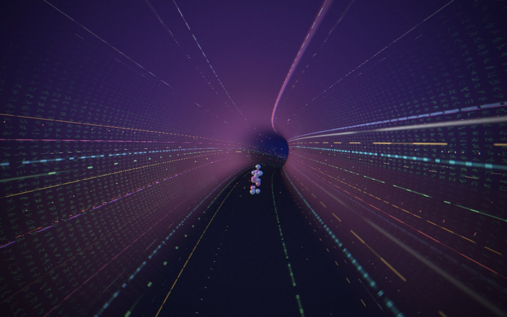
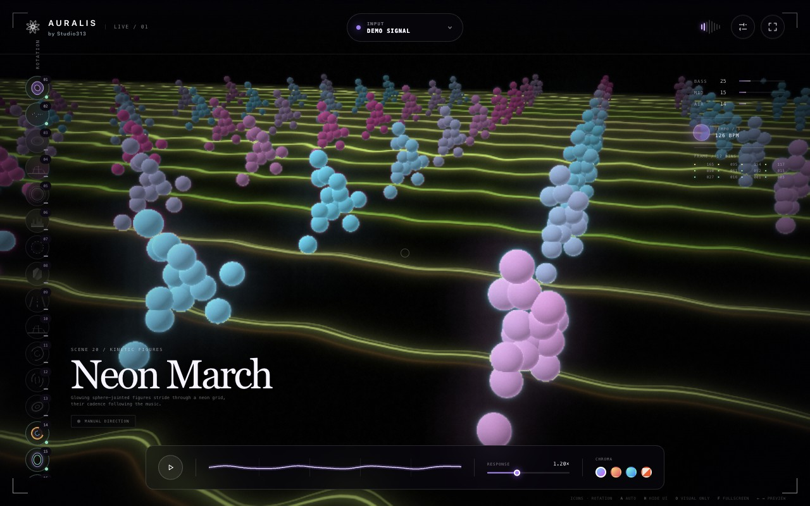

# Auralis — make sound visible

Made by **Studio313**.

A real-time, music-reactive visualiser for the browser: psychedelic flowers,
neon landscapes, enclosed tunnels, crystalline worlds and flowing feedback.
**16 effects. Live Mac microphone input. Procedural graphics. No audio uploads.**


## Tech stack

| Technology | Role |
| --- | --- |
| **Three.js 0.180 + WebGL / GLSL** | GPU scenes, procedural geometry, instancing, camera paths and custom shaders. |
| **p5.js 2.3** | Reactive particles and spring-smoothed live waveform overlays. |
| **Web Audio API** | Microphone/local-file input, 2,048-point FFT, six frequency bands, waveform analysis, transient and tempo detection. |
| **Custom GPU rendering** | Half-float HDR targets, bloom, feedback trails, fluid simulation, tone mapping and live scene blending. |
| **JavaScript ES modules + HTML/CSS** | Application state, accessible controls, responsive UI and browser-local preferences. No React or backend server. |
| **Vite 7.3** | Local development server and production bundling. |
| **Electron 44 + electron-builder 26** | Standalone Mac app and DMG packaging, sandboxed renderer and macOS microphone permissions. |
| **Vitest 5** | Automated coverage for audio, scenes, motion, transitions, resources and rotation controls. |
| **Node.js 22.12+ / npm** | Development tooling and the Chrome screenshot capture script. |

Exact dependency versions are pinned in [package-lock.json](package-lock.json).

## What it does

- Responds to bass, mids, treble, waveform shape and detected beats—not just overall volume.
- Generates scenes in real time, including instanced crystals, streaming terrain,
  closed-loop tunnel geometry, fluid smoke and persistent neon trails.
- Blends between two live scenes over **1.6 seconds**, without fading through black.
- Offers four colour palettes, global Response intensity, fullscreen and a visual-only mode. Response scales waves, spectrum, audio-reactive motion, beat pulses and glow across all scenes without changing playback volume or beat timing.
- Shows a live oscilloscope waveform in the control deck, with a steady zero-crossing trigger and response-linked amplitude.
- Provides **Auto / High / Ultra** quality settings, bounded resource pools and
  adaptive render scaling in Auto mode.
- Lets you enable each scene and set its duration in the **Scene Timers** pop-up, opened from Options or **View → Scene Timers…**. Choose **5–600 seconds**, or **0 for 16-beat timing**. Defaults are **20 seconds for Horizon**, **30 seconds for Neon City**, and **5 seconds for all other scenes**. Existing zero timers are upgraded to 5 seconds once; other custom times are preserved.
- Processes audio on the device. Microphone sound is not recorded or uploaded.

## Run locally

### Mac desktop app

The Apple Silicon build (macOS 13 or later) is **Auralis by Studio313**, packaged as a standalone
`.app` inside a drag-to-Applications `.dmg`. It includes Chromium and the renderer;
no browser tab, Node installation or development server is needed. Visualisation
works offline; no account connection or sign-in is required.
Choose **Use Mac microphone** and approve macOS microphone
access, or use a local audio file / **Demo music**.

Demo music bundles two original Auralis tracks: **Neon Current** (138 BPM acid
techno) and **Chrome Pressure** (154 BPM hard techno). Each session randomly
chooses the first track, then alternates every 50 seconds with a four-second
equal-power crossfade. Each turn plays from the beginning. Playback is offline
and the real music mix drives the FFT, waveform and beat detection. Nothing
plays until you explicitly choose Demo music; switching to microphone or a
file stops all scheduled demo playback. Pause visual freezes only the visuals,
not the music, matching normal file playback.

To build a signed release on an Apple Silicon Mac with Node and Apple's Command
Line Tools, install the configured Developer ID Application certificate and its
private key in your Keychain. Store notarisation credentials interactively with
`xcrun notarytool store-credentials "auralis-notary"` (never commit passwords), then:

```sh
npm ci
npm run dist:mac
```

Output: `release/Auralis-1.0.0-mac-arm64.dmg`. `npm run desktop` builds and opens
a signed local `.context/desktop/Auralis.app` using the same Auralis bundle ID,
name, icon and signing identity. It replaces only this workspace's running
preview, retains the previous preview as a backup, and leaves the release DMG
and any installed `/Applications` copy untouched. Local previews are signed,
but are not submitted for notarisation. Build outputs are ignored by Git.

Release builds require **Developer ID signing, hardened runtime and Apple
notarisation**. The script validates credentials first, notarises and staples the
app and final DMG, and checks Gatekeeper acceptance. This uploads the release to
Apple for notarisation, but does not publish to GitHub or the Mac App Store.
`APPLE_KEYCHAIN_PROFILE` can select another stored credential profile. Developers
using their own signing identity must update `mac.identity` in `electron-builder.json`.
The earlier ad-hoc DMG is not a notarised release; use the newly verified artifact.
For local development without signing credentials, use `npm run desktop:unpackaged`.
That explicit fallback runs as Electron, with its own icon and microphone permission;
use `npm run desktop` for consistent Auralis branding and app identity.
Microphone access can be changed in **System Settings → Privacy & Security →
Microphone**. When a microphone attempt is blocked by macOS, Auralis opens that
page automatically (at most once per app launch). Enable Auralis, then quit and
reopen it. If Settings cannot open, the app keeps the manual instructions visible.
Browser previews do not open OS settings automatically. Do not disable Gatekeeper globally.


### Browser development

Use Node.js **22 LTS (22.12+) or 24 LTS** and a current WebGL-capable browser.

```sh
git clone https://github.com/SkiltonUSA/auralis-music-visualiser.git
cd auralis-music-visualiser
npm ci
npm run dev
```

Open the URL printed by Vite, normally `http://localhost:5173`, and choose:

- **Mac microphone** — allow browser/macOS microphone access, then play music in the room.
- **Open an audio file** — play a local file in a format your browser supports.
- **Demo music** — play the two bundled original techno tracks without
  microphone access. A random track starts; music crossfades every 50 seconds.

Microphone access requires **localhost or HTTPS**; opening `index.html` directly
will not work. The microphone captures the room, not native system-loopback audio.
For music played through headphones, use local-file playback or an audio-routing
device configured outside the app.

## Effect gallery

Every image below is an actual browser capture of the current app, using the
built-in demo signal in visual-only mode at **1280 × 800**. Procedural seeds and
music change the appearance between sessions. Click an image to view it at full size.

| Scene | Effect and music response | Screenshot |
| --- | --- | --- |
| **01 · Neon City** | Descend from above a blue-violet metropolis, then climb, dip and bank gently above its streets. Eight building types and original city art from Synthcity bring detailed dark façades, clustered windows, projecting neon signs and rooftop light shafts. Music drives their lighting and flowing Aura ribbons in the sky. Defaults to 30 seconds in Auto Director; adjustable in Options. | [](docs/screenshots/21-neon-city.jpg) |
| **02 · Bloom** | Mirrored flowers, travelling waveform rings, fluid smoke and a restrained Geiss Flow background. Bass opens the petals; beats launch sound waves. | [](docs/screenshots/01-bloom.jpg) |
| **03 · Torus** | Fly inside a curving checker tunnel. Walls breathe with bass; every fifth tile flashes on detected beats. | [](docs/screenshots/04-torus.jpg) |
| **04 · Valley** | A smooth bird-like flight through music-shaped ridges and valleys, with a deep horizon and thin drifting wisps. | [](docs/screenshots/06-valley.jpg) |
| **05 · Reactor** | A radial instrument-like structure with concentric details and transient-driven bursts. | [](docs/screenshots/07-reactor.jpg) |
| **06 · Horizon** | 29 mirrored frequency bands form a skyline above an approaching waveform floor. Aura's music-reactive light folds flow behind the towers, softly fading above the ground. Defaults to 20 seconds in Auto Director; adjustable in Options. | [](docs/screenshots/08-horizon.jpg) |
| **07 · Radial** | Extruded circular spectrum blocks with slow, smoothly integrated musical rotation and responsive highlights. | [](docs/screenshots/09-radial.jpg) |
| **08 · Crystals** | A smooth, dark reflective globe with neon studio highlights, five quartz shapes and beat-driven growth travelling across its surface. Spin follows musical tempo; triangular light ripples, Spirit-style GPU particles, a passing smoke wisp, aurora curtains and Horizon's approaching waveform floor complete the scene. | [](docs/screenshots/11-crystals.jpg) |
| **09 · Neon Road** | An ’80s neon highway with a route-following camera, striped sunset, grid mountains, roadside lights, smoke and clouds. | [](docs/screenshots/12-neon-road.jpg) |
| **10 · Dark Matter** | A volumetric cloud vortex around a dark core, with a glowing live oscilloscope below it. Bass shapes density and swirl; detected beats send restrained pulses outward through the cloud. | [](docs/screenshots/17-dark-matter.jpg) |
| **11 · Light Tunnel** | Continuous flight through amber, cream, pink and blue light strips, with a stationary, distant Dark Matter cloud on the right and a fixed starfield. Music shapes tunnel speed and strip brightness; beat highlights approach the camera. | [](docs/screenshots/18-light-tunnel.jpg) |
| **12 · Fractal Lotus** | An orbiting view through a holographic crystal web built from mirrored space folds. Bass gently changes filament thickness and orbit speed, mids advance the morph, and beats and treble illuminate fine detail and drifting sparks. | [](docs/screenshots/19-fractal-lotus.jpg) |
| **13 · Voxel Tunnel** | A luminous square corridor with folded, voxel-quantised walls and layered depth. Bass smoothly changes forward speed and width, mids animate turbulence, and beats brighten the walls around a softly glowing core. | [](docs/screenshots/20-voxel-tunnel.jpg) |
| **14 · Magnetic Silk** | Smoothly flowing metallic folds with beat-triggered colour ripples travelling across the silk and holographic edges. Continuous movement without beat-driven jolts. | [](docs/screenshots/18-magnetic-silk.jpg) |
| **15 · Cyber Tunnel** | Smooth flight through a looping neon corridor with segmented lanes, broken rings, generated data glyphs, holographic panels and rippled floor reflections. One sphere-jointed Neon March character marches farther ahead near the bend, its polished surface reflecting the actual tunnel lights. Bass gently increases speed; beats and treble light the walls. | [](docs/screenshots/19-cyber-tunnel.jpg) |
| **16 · Neon March** | Rows of glowing sphere-jointed figures stride above Horizon-style synthwave floor lines flowing towards the viewer. The lines retain captured audio waveforms; tempo shapes the marchers' cadence, while beats and treble brighten their neon joints. | [](docs/screenshots/20-neon-march.jpg) |

## Controls

| Control | Action |
| --- | --- |
| **Side icons** | Include/exclude scenes from Auto Director—not effect-layer toggles. |
| **L / Load Music** | Open a local audio file. |
| **M / Microphone** | Switch to microphone input (permission required). |
| **D / Demo** | Play the bundled music with a random first track and 50-second rotation. |
| **S / Options** | Open/close the settings panel. |
| **Lit dot / dim dash** | Scene enabled / excluded from rotation. |
| **Bright outline** | Currently selected scene, independent of rotation membership. |
| **← / →** | Preview any scene, including excluded scenes. |
| **1–9** | Preview scenes 1–9. |
| **A** | Toggle Auto Director. |
| **Space** | Pause/resume visuals; when a button is focused, activate that button. |
| **O** | Hide/show all text, controls and framing for visuals only. |
| **H** | Hide/show the main interface. |
| **F** | Toggle fullscreen. |
| **Settings** | Audio source, particle veil, Auto Director, per-scene durations/on-off switches and render quality. |

The Mac menu bar also provides **File → Load Music (⌘O)**, microphone and demo
input, a **Visualiser** menu for playback/direction/scene changes, and **View**
actions for fullscreen, options and hiding/restoring the interface. Press **O**
again to restore all controls from the clean visual-only view. Shortcuts do not
intercept typing in form fields or standard Command/Control shortcuts.

Signal, Flyover, Geiss Flow, Aura and Ferrofluid are retired as standalone scenes.
Bloom retains its Geiss-style background; Horizon and Neon City retain Aura.
These changes require a fresh desktop build and are not in the older DMG.

Rotation choices and per-scene times are saved locally. The Scene Timers switches stay
in sync with the side icons. Timed scenes start blending out when their duration
expires, even without a beat; 0 uses 16 detected beats. Pauses, hidden-window time,
manual direction and incoming blends do not consume the timer. Editing the current
scene's time restarts its timer. **Reset times** restores the defaults without
changing scene inclusion. The scene status shows the configured duration, not a
running countdown. Options shows a fixed app version; live FPS remains below BPM.
Auto Director skips excluded
scenes. Disabling its current selection blends to the next enabled scene. One
enabled scene holds; disabling every scene holds the current picture and stops
automatic scene changes. Manual previews do not change the saved rotation.

## Development and production

```sh
npm test          # automated test suite
npm run build    # production files in dist/
npm run preview  # serve the production build locally
```

The production app is static: deploy `dist/` to an HTTPS static host. No application
server, API key, database, Python environment or native audio plug-in is required.
For subdirectory hosting, configure Vite's base path for the deployment location.

### Project structure

```text
src/
  audio-engine.js          Microphone/file/demo sources, FFT and beat analysis
  visual-engine.js         Main renderer, scene shaders and layer composition
  procedural-scenes.js     Lazy procedural worlds and crystal formations
  aura-scene.js            Music-reactive ray-marched light folds
  dark-matter.js           Volumetric cloud vortex and outward beat pulses
  light-tunnel.js          Curved light-strip flight, stars and beat highlights
  fractal-lotus.js         Holographic space-fold fractal and orbiting sparks
  voxel-tunnel.js          Infinite folded square corridor and voxel turbulence
  magnetic-silk.js         Music-reactive metallic folds and holographic edges
  cyber-tunnel.js          Neon data corridor, holograms and floor reflections
  terrain-flyover.js       Streaming terrain and route-following flight
  neon-road.js             Procedural synthwave road
  neon-city.js             Streaming instanced city blocks, spectral façades and traffic
  neon-march.js            Ray-marched sphere-joint figures and tempo-driven gait
  ferrofluid.js            GPU-displaced spectral liquid with studio reflections
  endless-tunnel.js        Enclosed checker and plasma tunnel geometry
  tunnel-ring-pulses.js    Narrow beat pulses travelling towards the camera
  neon-crystals.js         Physical reflections, neon edges and triangle lighting
  crystal-studio.js        Procedural HDR softboxes for the crystal globe
  crystal-facet-ripples.js Beat-triggered ripples across the crystal surface
  crystal-tempo-spin.js    Smooth BPM-driven globe rotation
  crystal-wave-floor.js    Horizon's waveform floor beneath the aurora
  geiss-flow.js            Persistent waveform-fed GPU feedback
  smoke-simulation.js      Audio-reactive fluid simulation
  bloom-waves.js           Travelling waveform snapshots
  post-processing.js       HDR bloom, feedback and cinematic finishing
  particle-overlay.js      p5.js particles and spring waveform overlays
  scene-blend.js           Live crossfade state and queued selections
  scene-mixer.js           Two-scene HDR compositing
  scene-rotation.js        Auto Director inclusion/exclusion state
  scenes.js               Scene catalogue and stable renderer IDs
  main.js                 UI, preferences and animation orchestration
  *.test.js               Regression tests
docs/screenshots/         All 16 active scene captures and their manifest
scripts/capture-gallery.mjs
```

Detailed implementation notes, effect tuning and creative provenance are in
[docs/technical-notes.md](docs/technical-notes.md).

### Regenerate screenshots

Use a **dedicated Chrome profile**, not your normal browsing session. First start
Vite, then launch Chrome with remote debugging enabled (macOS example):

```sh
"/Applications/Google Chrome.app/Contents/MacOS/Google Chrome" \
  --headless=new --remote-debugging-port=9231 \
  --user-data-dir="$(mktemp -d /tmp/auralis-gallery.XXXXXX)" \
  --window-size=1280,800 http://127.0.0.1:5173/
```

In another terminal, from the project directory:

```sh
APP_URL=http://127.0.0.1:5173/ CDP_PORT=9231 npm run screenshots
```

The script plays the bundled demo music, warms up each scene, waits until no blend is
active, and captures the browser output. Originals are saved under the ignored
`.context/gallery/` directory; README copies and capture metadata go into
`docs/screenshots/`. It checks for browser errors and adds no browser automation
dependency. Allow several minutes, especially with software rendering.

## Performance and troubleshooting

- **Photosensitivity warning:** Auralis contains flashing lights and patterns that
  may trigger photosensitive seizures. Read the startup warning before starting.
  The welcome screen is static; effects start only after you choose an audio source
  or Demo. See the [Epilepsy Foundation's photosensitivity information](https://www.epilepsy.com/what-is-epilepsy/seizure-triggers/photosensitivity).
- **Microphone setup:** Choose **Use microphone** from the welcome screen,
  Options, the File menu or the M key. These share one request and status. Allow
  access if prompted; the current system input is used. While waiting, Cancel,
  Demo and music files remain available. Cancel abandons Auralis's request; it
  cannot dismiss an operating-system prompt, and any late-granted stream is stopped.
  Device/permission errors show specific retry guidance. If an input disconnects,
  Auralis returns to Demo. Microphone audio is never routed to the speakers.
- **Start with Auto quality.** Ultra increases GPU cost, especially during live
  blends and procedural scenes. Performance depends on the GPU and display size.
- **No microphone response?** Check the selected input, browser permission and
  macOS microphone privacy settings. Try Demo to isolate rendering from input issues.
- **No audible demo?** Choose **Demo music** to activate playback, and check your Mac output volume. If a track fails to load, retry or use **Load music**. The silent synthetic signal is retained only as an internal fallback after source errors.
- **Scene never appears automatically?** Enable its side icon and Auto Director.
- **Blank canvas or graphics errors?** Use a current browser with hardware acceleration
  and WebGL enabled. Device capabilities can limit fluid smoke support.
- **Build warnings?** The bundle is currently large; Vite may issue a chunk-size
  warning. It is a warning, not a failed build. Code splitting is a future improvement.

## Credits and licensing

On Mac, open **Auralis → About Auralis** for author credits, then **Licences** to
read the bundled project licence and third-party notices offline. The browser
version opens the same dialog through **Options → About Auralis**. Close Licences
to return to About; press Escape or the close button again to return to the visualiser.

Code, techniques and asset credits:

| Author / organisation | Project / contribution |
| --- | --- |
| Jeff Beene | Synthcity — city-generation ideas, building models and textures |
| Edan Kwan | The Spirit — GPU particles and curl-noise helpers |
| mohamedachrefelouafi / achrefelouafi | GeometryPainterThreeJS — crystal geometry, materials and aurora techniques |
| Jack Purvis / EmperorJack | Smokey BBQ — fluid-smoke simulation and audio compositions |
| isoteriksoftware | React Smoke — smoke particles and texture |
| Rajavanya Subramaniyan / quakeboy | Endless Tunnel — torus geometry and tunnel approach |
| ZyFou | ProceduralTerrains — terrain grid and skirt construction |
| Mike Cao | Astrofox — feedback, lens-warp and glow techniques |

Creative references include Jeff Minter's psychedelic visualisers, Fosfora,
ShaderAmp, pdoom-video, NEON, AudioVisualize, Astrofox and Geiss. Geometry, tunnel
and fluid-simulation adaptations are credited individually. Roomtone inspired
the former ASCII composition, now replaced by Aura; its source was not copied. Geiss Flow is an original GPU
implementation of the waveform-and-warp feedback idea, not a native Winamp port.

See [THIRD_PARTY_NOTICES.md](THIRD_PARTY_NOTICES.md) for provenance, source links
and retained third-party license notices. Original Auralis code is released under
the [MIT License](LICENSE), copyright © 2026 Studio313. Third-party code and assets
retain their respective licences; this licence does not relicense those materials.
